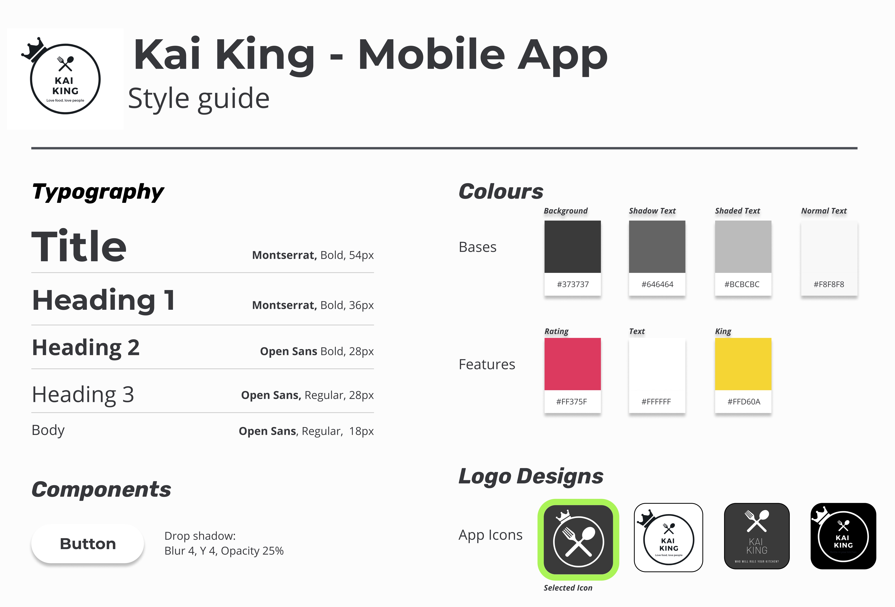
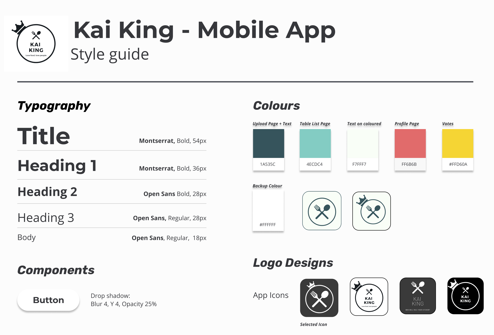
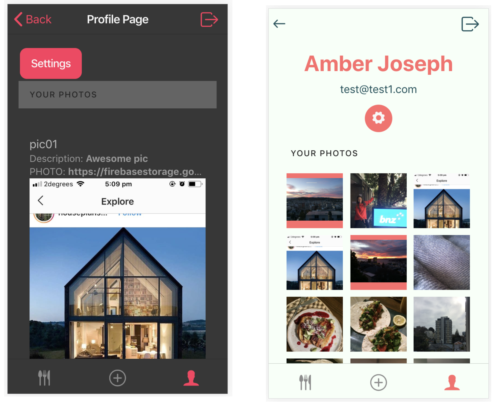

# DESIGN GUIDE

This was the first style guide which I made. After several weeks of working with these colours I decided
that I no longer liked them or felt they represented the app well. They were dark and heavy, and when I showed it
to my friends and other users, they felt it was difficult to read or look at for long periods of time. 

So I started to go looking for some more inspirationn and found this combination of colours from www.coolors.com 

This led me to creating my second style guide below:

I enjoyed using this much more and found I got more positive feedback from my friends. You can see the difference between 
pages below:

